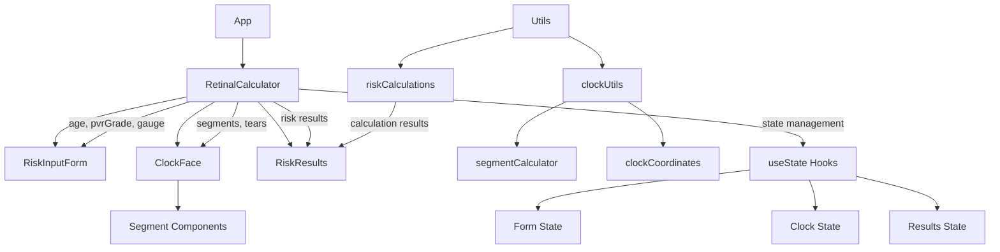

# Retinal Calculator Application Analysis

## Component Structure



## Core Functionality Analysis

### Risk Calculation Model
- **Input Factors**
  - Age (grouped into ranges)
  - Break location (clock positions)
  - Detachment extent
  - PVR grade
  - Vitrectomy gauge
- **Calculation Process**
  1. Input categorization
  2. Coefficient application
  3. Logistic regression
  4. Probability calculation
- **Key Features**
  - Step-by-step calculation breakdown
  - Evidence-based coefficients
  - Clear result presentation

### Clock Face Implementation
- **Visual Components**
  - SVG-based circular display
  - Interactive segments (60 total)
  - Tear markers at hour positions
  - Visual indicators for selection
- **Interaction Handling**
  - Touch/mouse event processing
  - Segment drawing capabilities
  - Tear marker toggling
  - Hour-based selection
- **Mathematical Model**
  - 60-segment division
  - Hour-to-segment mapping
  - Wraparound handling
  - Range calculations

## Component Analysis

### RetinalCalculator (Main Container)
- **Responsibilities**
  - Central state management
  - Layout coordination
  - Risk calculation orchestration
  - Mobile/desktop view switching
- **State Management**
  - Form inputs (age, PVR grade, gauge)
  - Clock selections (tears, detachment segments)
  - Calculation results
  - UI state (hover, touch device)

### RiskInputForm
- **Responsibilities**
  - Age input with validation (18-100 range)
  - PVR grade selection (none/A/B/C)
  - Vitrectomy gauge selection (23g/25g/27g)
  - Mobile/desktop layout adaptation
- **Key Features**
  - Form validation
  - Accessibility support
  - Responsive design
  - Error messaging

### ClockFace
- **Responsibilities**
  - Visual clock representation
  - Tear marker interaction
  - Detachment segment drawing
  - Touch/mouse input handling
- **Key Features**
  - SVG-based visualization
  - 60-segment division
  - Interactive segments
  - Visual feedback
- **Technical Implementation**
  - Polar coordinate calculations
  - Segment interpolation
  - Event delegation
  - Touch gesture handling

### RiskResults
- **Responsibilities**
  - Display calculation results
  - Show detailed calculation steps
  - Format probability display
- **Key Features**
  - Expandable calculation details
  - Mathematical step breakdown
  - Clear result presentation
  - Coefficient explanation

## Technical Implementation Details

### Risk Calculation Logic
```javascript
// Logistic regression model
probability = 1 / (1 + e^(-logit))

// Logit calculation
logit = constant +
        age_coefficient +
        break_location_coefficient +
        detachment_coefficient +
        pvr_coefficient +
        gauge_coefficient
```

### Clock Face Mathematics
```javascript
// Segment to hour conversion
hour = Math.floor(segment / 5) + 1

// Hour to segment range
startSegment = (hour - 1) * 5
endSegment = hour * 5 - 1

// Handle wraparound
if (endSegment < startSegment) {
    segments = [...range(startSegment, 59), ...range(0, endSegment)]
}
```

## Areas for Improvement

### 1. State Management
- **Current**: Uses React useState hooks at the RetinalCalculator level
- **Potential Improvements**:
  - Implement useReducer for complex state logic
  - Add state persistence for form data
  - Create custom hooks for clock state
  - Add state validation middleware

### 2. Component Organization
- **Current**: Flat component structure with some nesting
- **Potential Improvements**:
  - Create feature-based folder structure
  - Split ClockFace into smaller components
  - Extract common form elements
  - Implement proper component boundaries

### 3. Form Handling
- **Current**: Basic form validation with some accessibility
- **Potential Improvements**:
  - Implement form state management library
  - Enhance validation feedback
  - Add error boundary handling
  - Improve accessibility features
  - Add input masking
  - Implement proper form submission handling

### 4. Clock Interaction
- **Current**: Direct DOM manipulation for touch/mouse events
- **Potential Improvements**:
  - Abstract interaction logic into custom hooks
  - Implement gesture library for touch handling
  - Add animation for state changes
  - Improve touch feedback
  - Add keyboard navigation
  - Implement proper event delegation

### 5. Code Organization
- **Current**: Mixed utilities and components
- **Potential Improvements**:
  - Create dedicated services layer
  - Implement proper TypeScript typing
  - Add proper error handling
  - Enhance test coverage
  - Extract business logic
  - Implement proper dependency injection

### 6. Performance
- **Current**: Basic React rendering
- **Potential Improvements**:
  - Implement React.memo for pure components
  - Add virtualization for large datasets
  - Optimize SVG rendering
  - Add loading states
  - Implement proper caching
  - Optimize calculation logic

### 7. User Experience
- **Current**: Basic responsive design
- **Potential Improvements**:
  - Add proper loading states
  - Implement better error messaging
  - Add input validation feedback
  - Enhance mobile experience
  - Add progressive enhancement
  - Implement proper accessibility patterns

### 8. Testing
- **Current**: Basic component tests
- **Potential Improvements**:
  - Add end-to-end testing
  - Implement visual regression tests
  - Add performance testing
  - Enhance unit test coverage
  - Add integration tests
  - Implement proper test organization

## Implementation Priorities

### High Priority
- Enhance form accessibility
- Improve validation feedback
- Add error boundaries
- Implement proper TypeScript
- Add comprehensive error handling
- Improve mobile touch interactions

### Medium Priority
- Refactor state management
- Enhance mobile experience
- Add loading states
- Improve test coverage
- Implement proper form validation
- Add keyboard navigation

### Low Priority
- Add animation effects
- Implement persistence
- Add advanced features
- Optimize performance
- Add analytics
- Implement advanced visualizations

## Conclusion

The application demonstrates a well-structured approach to medical risk calculation with a strong focus on visual interaction through the clock face component. The mathematical model is properly implemented with clear separation of concerns between calculation logic and user interface.

The main areas for improvement focus on enhancing user experience, maintainability, and robustness rather than fundamental architectural changes. The suggested improvements can be implemented incrementally without disrupting the existing functionality.

Priority should be given to improving accessibility and form validation, followed by state management refactoring and enhanced mobile support. The clock face interaction model could benefit from more robust touch handling and keyboard navigation support.

The application provides a solid foundation for future enhancements, with clear separation of concerns and modular architecture that will support additional features and optimizations.
