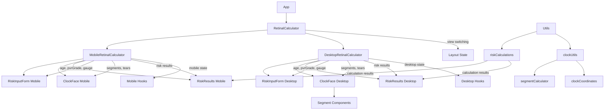

# Retinal Calculator Application Analysis

## Component Structure



## Core Functionality Analysis

### Risk Calculation Model
- **Input Factors**
  - Age (grouped into ranges)
  - Break location (clock positions)
  - Detachment extent
  - PVR grade
  - Vitrectomy gauge
- **Calculation Process**
  1. Input categorization
  2. Coefficient application
  3. Logistic regression
  4. Probability calculation
- **Key Features**
  - Step-by-step calculation breakdown
  - Evidence-based coefficients
  - Clear result presentation

### Clock Face Implementation
- **Visual Components**
  - SVG-based circular display
  - Interactive segments (60 total)
  - Tear markers at hour positions
  - Visual indicators for selection
- **Interaction Handling**
  - Touch/mouse event processing
  - Segment drawing capabilities
  - Tear marker toggling
  - Hour-based selection
- **Mathematical Model**
  - 60-segment division
  - Hour-to-segment mapping
  - Wraparound handling
  - Range calculations

## Component Analysis

### RetinalCalculator (Container)
- **Responsibilities**
  - View switching based on screen size
  - Layout coordination
  - Component composition
- **Key Features**
  - Responsive design
  - Clean separation of mobile/desktop views
  - Consistent header across views

### MobileRetinalCalculator
- **Responsibilities**
  - Mobile-specific layout
  - Touch interaction handling
  - Vertical form layout
  - Single clock face instance
- **Key Features**
  - Touch-optimized interface
  - Compact layout
  - Simplified interaction model
  - Mobile-specific validations

### DesktopRetinalCalculator
- **Responsibilities**
  - Desktop-specific layout
  - Mouse interaction handling
  - Three-column layout
  - Synchronized form instances
- **Key Features**
  - Mouse-optimized interface
  - Split-screen layout
  - Advanced interaction model
  - Desktop-specific validations

### RiskInputForm
- **Responsibilities**
  - Age input with validation (18-100 range)
  - PVR grade selection (none/A/B/C)
  - Vitrectomy gauge selection (23g/25g/27g)
  - Mobile/desktop layout adaptation
- **Key Features**
  - Form validation
  - Accessibility support
  - Responsive design
  - Error messaging

### ClockFace
- **Responsibilities**
  - Visual clock representation
  - Tear marker interaction
  - Detachment segment drawing
  - Touch/mouse input handling
- **Key Features**
  - SVG-based visualization
  - 60-segment division
  - Interactive segments
  - Visual feedback
- **Technical Implementation**
  - Polar coordinate calculations
  - Segment interpolation
  - Event delegation
  - Touch gesture handling

### RiskResults
- **Responsibilities**
  - Display calculation results
  - Show detailed calculation steps
  - Format probability display
- **Key Features**
  - Expandable calculation details
  - Mathematical step breakdown
  - Clear result presentation
  - Coefficient explanation

## Technical Implementation Details

### Risk Calculation Logic
```javascript
// Logistic regression model
probability = 1 / (1 + e^(-logit))

// Logit calculation
logit = constant +
        age_coefficient +
        break_location_coefficient +
        detachment_coefficient +
        pvr_coefficient +
        gauge_coefficient
```

### Clock Face Mathematics
```javascript
// Segment to hour conversion
hour = Math.floor(segment / 5) + 1

// Hour to segment range
startSegment = (hour - 1) * 5
endSegment = hour * 5 - 1

// Handle wraparound
if (endSegment < startSegment) {
    segments = [...range(startSegment, 59), ...range(0, endSegment)]
}
```

## Areas for Improvement

### 1. View Management
- **Current**: Separate mobile and desktop components with shared logic
- **Potential Improvements**:
  - Extract more shared logic to hooks
  - Create view-specific hooks
  - Improve state sharing between views
  - Add view transition animations
  - Enhance view-specific testing

### 2. Component Organization
- **Current**: View-based component structure
- **Potential Improvements**:
  - Create shared component library
  - Extract common patterns
  - Standardize component interfaces
  - Improve component documentation
  - Add component storybook

### 3. Form Handling
- **Current**: Basic form validation with some accessibility
- **Potential Improvements**:
  - Implement form state management library
  - Enhance validation feedback
  - Add error boundary handling
  - Improve accessibility features
  - Add input masking
  - Implement proper form submission handling

### 4. Clock Interaction
- **Current**: Direct DOM manipulation for touch/mouse events
- **Potential Improvements**:
  - Abstract interaction logic into custom hooks
  - Implement gesture library for touch handling
  - Add animation for state changes
  - Improve touch feedback
  - Add keyboard navigation
  - Implement proper event delegation

### 5. Code Organization
- **Current**: Mixed utilities and components
- **Potential Improvements**:
  - Create dedicated services layer
  - Implement proper TypeScript typing
  - Add proper error handling
  - Enhance test coverage
  - Extract business logic
  - Implement proper dependency injection

### 6. Performance
- **Current**: Basic React rendering
- **Potential Improvements**:
  - Implement React.memo for pure components
  - Add virtualization for large datasets
  - Optimize SVG rendering
  - Add loading states
  - Implement proper caching
  - Optimize calculation logic

### 7. User Experience
- **Current**: Basic responsive design
- **Potential Improvements**:
  - Add proper loading states
  - Implement better error messaging
  - Add input validation feedback
  - Enhance mobile experience
  - Add progressive enhancement
  - Implement proper accessibility patterns

### 8. Testing
- **Current**: Comprehensive test suite with view-specific tests
- **Potential Improvements**:
  - Add end-to-end testing
  - Implement visual regression tests
  - Add performance testing
  - Further enhance unit test coverage
  - Add integration tests
  - Implement proper test organization

## Implementation Priorities

### Highest Priority
- ✅ Separate mobile and desktop views
- ✅ Fix desktop clockface
- ✅ Implement proper test organization

### High Priority
- Create shared component library
- Extract common view patterns
- Enhance form accessibility
- Improve validation feedback
- Add error boundaries

### Medium Priority
- Create view-specific hooks
- Add view transitions
- Improve state sharing
- Add loading states
- Enhance test coverage

### Low Priority
- Add animation effects
- Implement persistence
- Add advanced features
- Optimize performance
- Add analytics

## Conclusion

The application has been successfully refactored to separate mobile and desktop views while maintaining a clean architecture and shared business logic. The new structure provides better maintainability and clearer responsibility boundaries between views.

Recent improvements include:
- Clear separation of mobile and desktop components
- Improved test organization and reliability
- Better component boundaries and responsibilities
- Maintained shared business logic while separating view concerns

Next steps focus on:
1. Creating a shared component library
2. Extracting common view patterns
3. Improving state sharing between views
4. Enhancing view-specific testing
5. Adding view transitions and animations

The application now has a solid foundation for view-specific optimizations while maintaining code quality and testability. Future enhancements can be implemented incrementally with clear boundaries between shared and view-specific concerns.
